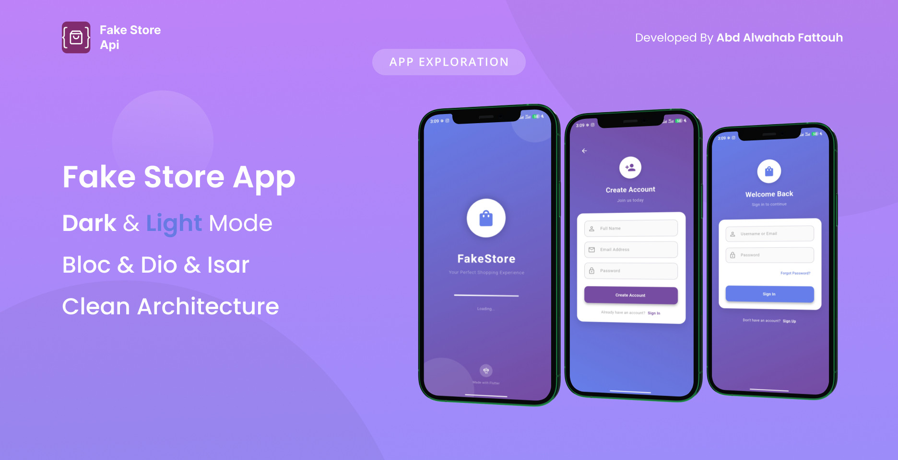

# FakeStore Task

A modern Flutter e-commerce application built with clean architecture, featuring user authentication, product browsing, cart management, and profile handling. This app demonstrates best practices in Flutter development using BLoC for state management, dependency injection, and local data persistence.

# App UI



## Features

### 🔐 Authentication
- User login and registration
- Secure token-based authentication
- Persistent login state
- Form validation with custom validators

### 🛍️ Product Management
- Browse products from FakeStore API
- Search functionality
- Filter by category and price range
- Product details with image carousel
- Add to cart functionality

### 🛒 Cart Management
- View multiple carts
- Add/remove items from cart
- Cart details and totals
- Checkout simulation
- Local cart persistence with Isar database

### 👤 Profile Management
- User profile display
- Account information
- Logout functionality

### 🎨 UI/UX
- Beautiful gradient designs
- Dark/Light theme support
- Responsive design
- Smooth animations and transitions
- Loading states with custom loaders
- Error handling with user-friendly messages

## Technologies Used

### Core Framework
- **Flutter** - Cross-platform mobile development framework
- **Dart** - Programming language

### State Management
- **BLoC (Business Logic Component)** - For predictable state management
- **flutter_bloc** - Official BLoC library for Flutter

### Networking
- **Dio** - HTTP client for API calls
- **Custom ApiClient** - Wrapper around Dio with error handling

### Local Storage
- **SharedPreferences** - For simple key-value storage (user data, tokens)
- **Isar** - NoSQL database for complex data (cart items)
- **isar_flutter_libs** - Flutter integration for Isar

### Dependency Injection
- **GetIt** - Service locator for dependency injection

### UI Components
- **Material Design** - Google's design system
- **Cupertino Icons** - iOS style icons
- **Custom Components** - Loading screens, bottom navigation, etc.

### Architecture
- **Clean Architecture** - Separation of concerns
- **Repository Pattern** - Data abstraction layer
- **Use Cases** - Business logic encapsulation

### Other Libraries
- **Equatable** - For value comparison
- **Dartz** - Functional programming utilities
- **Path Provider** - File system paths
- **Intl** - Internationalization

## Project Structure

```
lib/
├── core/                          # Core functionality
│   ├── components/                # Reusable UI components
│   │   ├── loading_page.dart      # Custom loading screens
│   │   └── widgets/               # Shared widgets
│   ├── constants/                 # App constants
│   │   ├── api_endpoints.dart     # API URLs
│   │   └── app_constants.dart     # App-wide constants
│   ├── errors/                    # Error handling
│   │   ├── exceptions.dart        # Custom exceptions
│   │   └── failures.dart          # Failure objects
│   ├── network/                   # Network layer
│   │   └── api_cclient.dart       # API client implementation
│   ├── services/                  # Services
│   │   ├── injection_container.dart # Dependency injection setup
│   │   ├── isar_db_helper.dart    # Isar database helper
│   │   └── local_storage_service.dart # SharedPreferences wrapper
│   ├── theme/                     # Theme configuration
│   │   ├── app_colors.dart        # Color palette
│   │   └── app_theme.dart         # Light/Dark themes
│   └── utils/                     # Utilities
│       ├── app_enum.dart          # Enums
│       ├── app_routes.dart        # Route definitions
│       └── validators.dart        # Input validation
├── features/                      # Feature-based modules
│   ├── auth/                      # Authentication feature
│   │   ├── data/                  # Data layer
│   │   │   ├── datasources/       # Data sources
│   │   │   ├── models/            # Data models
│   │   │   └── repository/        # Repository implementations
│   │   ├── domain/                # Domain layer
│   │   │   ├── entities/          # Business entities
│   │   │   ├── repositories/      # Abstract repositories
│   │   │   └── usecases/          # Use cases
│   │   └── presentation/          # Presentation layer
│   │       ├── bloc/              # BLoC logic
│   │       ├── view/              # UI screens
│   │       └── widgets/           # Feature-specific widgets
│   ├── products/                  # Products feature
│   ├── cart/                      # Cart management feature
│   ├── profile/                   # Profile feature
│   └── splash/                    # Splash screen feature
└── main.dart                      # App entry point
```

## Architecture Overview

This project follows **Clean Architecture** principles:

### Layers:
1. **Presentation Layer** - UI and BLoC state management
2. **Domain Layer** - Business logic and use cases
3. **Data Layer** - Data sources and repositories

### Key Patterns:
- **Repository Pattern** - Abstracts data sources
- **Dependency Inversion** - High-level modules don't depend on low-level modules
- **Single Responsibility** - Each class has one reason to change
- **BLoC Pattern** - Separation of business logic from UI

## API Integration

The app integrates with [FakeStore API](https://fakestoreapi.com/) for:
- User authentication (login/register)
- Product catalog
- User data

## Setup Instructions

### Prerequisites
- Flutter SDK (>=3.9.2)
- Dart SDK (>=3.9.2)
- Android Studio or VS Code with Flutter extensions

### Installation

1. **Clone the repository**
   ```bash
   git clone https://github.com/AbdalwahabFattouh/fake_store.git
   cd fakestoretask
   ```

2. **Install dependencies**
   ```bash
   flutter pub get
   ```

3. **Generate Isar database code**
   ```bash
   flutter pub run build_runner build
   ```

4. **Run the app**
   ```bash
   flutter run
   ```

### Build for Production

**Android APK:**
```bash
flutter build apk --release
```

## Configuration

### API Endpoints
Modify `lib/core/constants/api_endpoints.dart` to change API URLs.

### Themes
Customize colors in `lib/core/theme/app_colors.dart` and themes in `lib/core/theme/app_theme.dart`.

## Testing

Run tests:
```bash
flutter test
```

## Contributing

1. Fork the repository
2. Create a feature branch
3. Commit your changes
4. Push to the branch
5. Create a Pull Request

## License

This project is licensed under the MIT License - see the LICENSE file for details.

## Acknowledgments

- [FakeStore API](https://fakestoreapi.com/) for providing the backend
- Flutter community for excellent documentation and packages
- All contributors and maintainers

---

**Made with ❤️ using Flutter**
